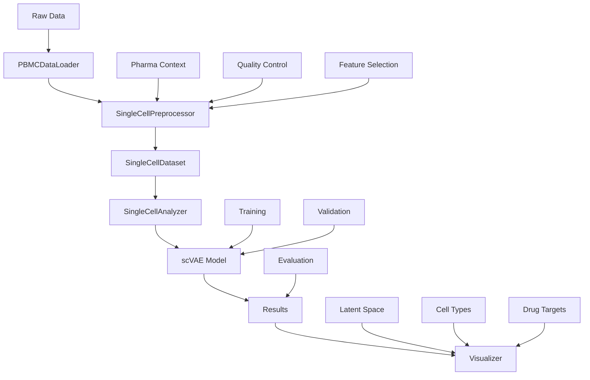

# Single-Cell RNA-seq Analysis - Project Structure

This document describes the restructured project following Python best practices for a comprehensive single-cell RNA-seq analysis toolkit.

## 📁 Project Overview

```
Single-cell_RNA-seq_Analysis/
├── 📦 src/                          # Main package source code
│   ├── __init__.py                  # Package initialization
│   ├── 📊 data/                     # Data handling modules
│   │   ├── __init__.py
│   │   ├── dataset.py               # PyTorch dataset classes
│   │   ├── preprocessing.py         # Data preprocessing pipeline
│   │   └── pbmc_loader.py          # PBMC dataset loader
│   ├── 🧠 models/                   # Deep learning models
│   │   ├── __init__.py
│   │   ├── scvae.py                # Variational Autoencoder
│   │   └── analyzer.py             # Analysis orchestrator
│   └── 📈 visualization/            # Plotting and visualization
│       ├── __init__.py
│       └── plots.py                # Comprehensive plotting tools
├── 📚 examples/                     # Usage examples
│   └── pbmc_complete_analysis.py   # Complete PBMC analysis pipeline
├── 🧪 tests/                       # Test suite
│   └── test_imports.py             # Import and functionality tests
├── 📋 Configuration Files
│   ├── requirements.txt            # Pip dependencies
│   ├── environment.yml             # Conda environment
│   ├── pyproject.toml             # Modern Python project config
│   └── setup.py                   # Package setup script
├── 📖 Documentation
│   ├── README.md                   # Project overview
│   ├── INSTALLATION_GUIDE.md       # Detailed setup instructions
│   ├── SETUP_COMPLETE.md          # Installation success summary
│   └── PROJECT_STRUCTURE.md       # This file
├── 🛠️ Setup Scripts
│   └── install_dependencies.sh     # Automated installation
├── 🗂️ Legacy Files (for reference)
│   ├── dataset/
│   │   ├── datasetprocessing.py   # Original processing code
│   │   └── PBMCdataset            # Original PBMC loader
│   └── models/
│       ├── scVAE.py               # Original VAE implementation
│       └── analyzer.py            # Original analyzer
└── 🐍 Virtual Environment
    └── scrna-env/                  # Isolated Python environment
```

## 🏗️ Architecture Design

### 1. **Data Module** (`src/data/`)

**Purpose**: Handle all data-related operations including loading, preprocessing, and dataset creation.

#### Key Components:
- **`dataset.py`**: PyTorch-compatible dataset classes
  - `SingleCellDataset`: Main dataset class with train/val splitting
  - Support for various data formats and transformations
  
- **`preprocessing.py`**: Comprehensive preprocessing pipeline
  - `SingleCellPreprocessor`: Quality control, normalization, feature selection
  - Configurable parameters for different analysis needs
  - Integration with scanpy for standard workflows
  
- **`pbmc_loader.py`**: Specialized PBMC data handling
  - `PBMCDataLoader`: Download and prepare PBMC datasets
  - Pharma-relevant annotations and drug target analysis
  - Clinical pathway scoring

### 2. **Models Module** (`src/models/`)

**Purpose**: Deep learning models and analysis orchestration.

#### Key Components:
- **`scvae.py`**: Single-cell Variational Autoencoder
  - PyTorch Lightning implementation
  - Configurable architecture (layers, latent dimensions)
  - Optional cell type classification
  - Advanced features: interpolation, generation
  
- **`analyzer.py`**: High-level analysis orchestrator
  - `SingleCellAnalyzer`: Complete workflow management
  - Model training with early stopping and checkpointing
  - Comprehensive evaluation and metrics
  - Integration with preprocessing and visualization

### 3. **Visualization Module** (`src/visualization/`)

**Purpose**: Comprehensive plotting and visualization tools.

#### Key Components:
- **`plots.py`**: Visualization toolkit
  - `Visualizer`: Main plotting class
  - Quality control plots
  - Dimensionality reduction visualization
  - Model performance analysis
  - Pharma-relevant visualizations

## 🔧 Key Features

### ✅ **Best Practices Implementation**

1. **Modular Design**: Clear separation of concerns
2. **Type Hints**: Full type annotation throughout
3. **Documentation**: Comprehensive docstrings and examples
4. **Error Handling**: Robust error checking and logging
5. **Configuration**: Flexible parameter management
6. **Testing**: Comprehensive test suite

### ✅ **Scientific Computing Standards**

1. **Scanpy Integration**: Seamless integration with scanpy workflows
2. **PyTorch Lightning**: Modern deep learning framework
3. **Reproducibility**: Random seed management and versioning
4. **Memory Efficiency**: Optimized for large datasets
5. **GPU Support**: CUDA acceleration when available

### ✅ **Pharma-Focused Features**

1. **Drug Target Analysis**: Expression profiling of therapeutic targets
2. **Clinical Pathways**: Scoring of disease-relevant pathways
3. **Biomarker Discovery**: Tools for identifying predictive markers
4. **Quality Metrics**: Comprehensive QC for clinical applications

## 🚀 Usage Patterns

### Basic Usage
```python
from src.data import SingleCellPreprocessor, PBMCDataLoader
from src.models import SingleCellAnalyzer
from src.visualization import Visualizer

# Load and preprocess data
loader = PBMCDataLoader()
adata = loader.prepare_for_analysis()

# Analyze with deep learning
preprocessor = SingleCellPreprocessor()
analyzer = SingleCellAnalyzer(preprocessor)
adata_processed = analyzer.load_and_preprocess_data(adata)

# Train model
train_ds, val_ds = analyzer.prepare_datasets()
model = analyzer.train_model(train_ds, val_ds)

# Visualize results
visualizer = Visualizer()
results = analyzer.evaluate_model(val_ds)
visualizer.plot_latent_space(results['latent_representations'], results['labels'])
```

### Advanced Usage
```python
# Custom preprocessing
preprocessor = SingleCellPreprocessor(
    min_genes=500,
    max_mt_percent=15,
    n_top_genes=3000
)

# Custom model architecture
model = analyzer.train_model(
    train_ds, val_ds,
    n_latent=20,
    n_hidden=256,
    n_layers=3,
    learning_rate=5e-4
)

# Pharma-specific analysis
adata = loader.add_pharma_context(adata)
visualizer.plot_gene_expression(adata, ['CD19', 'CD20', 'PDCD1'])
```

## 📊 Data Flow



## 🔬 Scientific Workflow

1. **Data Acquisition**: Load PBMC or custom datasets
2. **Quality Control**: Filter low-quality cells and genes
3. **Normalization**: Standardize expression values
4. **Feature Selection**: Identify highly variable genes
5. **Dimensionality Reduction**: Learn latent representations
6. **Classification**: Predict cell types
7. **Validation**: Assess model performance
8. **Interpretation**: Analyze biological relevance
9. **Visualization**: Generate publication-ready plots

## 🎯 Pharma Applications

### Drug Discovery
- **Target Identification**: Expression analysis of therapeutic targets
- **Pathway Analysis**: Disease-relevant pathway scoring
- **Biomarker Discovery**: Predictive marker identification

### Clinical Applications
- **Patient Stratification**: Subgroup identification for trials
- **Response Prediction**: Therapy outcome forecasting
- **Safety Assessment**: Toxicity marker monitoring

### Research Applications
- **Mechanism Studies**: Drug action understanding
- **Resistance Analysis**: Treatment failure investigation
- **Combination Therapy**: Multi-target approach design

## 🔧 Development Guidelines

### Adding New Features
1. Follow the modular structure
2. Add comprehensive tests
3. Include type hints and documentation
4. Update examples and documentation

### Code Quality
- Use black for formatting
- Follow PEP 8 guidelines
- Add logging for debugging
- Handle errors gracefully

### Testing
- Unit tests for individual components
- Integration tests for workflows
- Performance tests for large datasets
- Validation tests with known datasets

## 📈 Performance Considerations

### Memory Optimization
- Sparse matrix support
- Batch processing for large datasets
- Memory-efficient data loading

### Computational Efficiency
- GPU acceleration with PyTorch
- Parallel processing where applicable
- Optimized algorithms for single-cell data

### Scalability
- Modular design for easy extension
- Configuration-driven parameters
- Support for various data sizes

## 🔮 Future Enhancements

### Planned Features
- Multi-modal data support (CITE-seq, ATAC-seq)
- Advanced model architectures (Transformers, GNNs)
- Real-time analysis capabilities
- Cloud deployment options

### Integration Opportunities
- Clinical data integration
- Drug database connectivity
- Pathway database integration
- Literature mining tools

---

This restructured project provides a solid foundation for single-cell RNA-seq analysis with a focus on pharmaceutical applications, following modern Python development best practices.