```mermaid
graph TD
    A[📥 Raw PBMC Data] --> B[🧹 Preprocessing]
    B --> C[🔍 Quality Control]
    C --> D[📊 Normalization]
    D --> E[🎯 Feature Selection]
    E --> F[🔄 Dataset Creation]
    F --> G[🧠 Model Training]
    G --> H[📈 Evaluation]
    H --> I[📊 Visualization]
    I --> J[💾 Results Export]
    
    K[💊 Pharma Context] --> B
    L[🎯 Drug Targets] --> K
    M[🔬 Clinical Pathways] --> K
```

# Single-Cell RNA-seq Analysis Toolkit

[](https://www.python.org/downloads/)
[](https://pytorch.org/)
[](https://opensource.org/licenses/MIT)
[](https://github.com/psf/black)

> A comprehensive, production-ready toolkit for single-cell RNA sequencing data analysis with deep learning capabilities and pharmaceutical applications.

## 🌟 Key Features

- **🔬 Complete Analysis Pipeline**: From raw data to publication-ready results
- **🧠 Deep Learning Integration**: Variational Autoencoders with PyTorch Lightning
- **💊 Pharma-Focused**: Drug target analysis and clinical pathway scoring
- **📊 Rich Visualizations**: Publication-quality plots and interactive analysis
- **🏗️ Best Practices**: Modern Python architecture following industry standards
- **🧪 PBMC Integration**: Built-in support for PBMC datasets with annotations
- **⚡ GPU Accelerated**: CUDA support for faster training and inference
- **📈 Scalable**: Handles datasets from 1K to 1M+ cells efficiently

## 🚀 Quick Start

### Prerequisites

- Python 3.8 or higher
- 8GB+ RAM (16GB+ recommended for large datasets)
- Optional: CUDA-compatible GPU for acceleration (MPS support for Apple Silicon)

### Installation

#### Option 1: Automated Setup (Recommended)
```bash
git clone https://github.com/saraalrawi/Single-cell_RNA-seq_Analysis.git
cd Single-cell_RNA-seq_Analysis
chmod +x install_dependencies.sh
./install_dependencies.sh
```

#### Option 2: Manual Installation
```bash
# Clone repository
git clone https://github.com/saraalrawi/Single-cell_RNA-seq_Analysis.git
cd Single-cell_RNA-seq_Analysis

# Create virtual environment
python -m venv scrna-env
source scrna-env/bin/activate  # On Windows: scrna-env\Scripts\activate

# Install dependencies
pip install -r requirements.txt
```

#### Option 3: Conda Environment
```bash
conda env create -f environment.yml
conda activate scrna-analysis
```

### Verify Installation

```bash
# Activate environment (if not already active)
source scrna-env/bin/activate

# Test all components
python tests/test_imports.py
```

### Run Your First Analysis

```bash
# Complete pipeline with PBMC dataset
python run_pipeline.py

# Or run the detailed example
python examples/pbmc_complete_analysis.py

# Generate comprehensive visualizations
python examples/visualize_pbmc_clusters.py
```

## 📊 Pipeline Overview

### Complete Workflow

<div align="center">
  
  <p><em>Comprehensive analysis pipeline from raw data to pharmaceutical applications</em></p>
</div>

The pipeline integrates multiple stages of single-cell analysis:



### Processing Steps

| Step | Process | Output | Estimated Time |
|------|---------|--------|----------------|
| 1️⃣ | **Data Loading** | PBMC 3K dataset (~3,000 cells) | 1-2 min |
| 2️⃣ | **Quality Control** | Filtered cells and genes | 2-3 min |
| 3️⃣ | **Preprocessing** | Normalized, scaled data | 2-3 min |
| 4️⃣ | **Dataset Preparation** | Train/validation splits | <1 min |
| 5️⃣ | **Model Training** | Trained scVAE model | 5-15 min |
| 6️⃣ | **Evaluation** | Performance metrics | 1-2 min |
| 7️⃣ | **Visualization** | Plots and analysis | 2-3 min |
| 8️⃣ | **Export Results** | Saved files and reports | <1 min |

### Expected Outputs

```
📁 results/
├── 📊 pbmc_processed_with_analysis.h5ad  # Processed AnnData object
├── 🧠 pbmc_scvae_model.pth              # Trained PyTorch model
├── 📈 pbmc_analysis_results.csv         # Analysis results
└── 📋 training_log.txt                  # Training progress

📁 plots/
├── 🗺️ pbmc_umap_cell_types.png         # UMAP with cell type annotations
├── 🔬 pbmc_umap_leiden.png              # UMAP with Leiden clusters
├── 📊 pbmc_tsne_cell_types.png         # t-SNE visualization
├── 📈 pbmc_cell_type_distribution.png   # Cell type proportions
├── 🎯 pbmc_marker_genes_dotplot.png     # Marker gene expression patterns
├── 🧬 pbmc_key_markers_umap.png         # Key marker gene expression
├── 📊 pbmc_qc_metrics.png               # Quality control metrics
├── 🔄 pbmc_latent_space_umap.png        # VAE latent space (UMAP)
└── 🔄 pbmc_latent_space_tsne.png        # VAE latent space (t-SNE)
```

## 🏗️ Project Structure

```
📦 Single-cell_RNA-seq_Analysis/
├── 🧬 src/                          # Main package
│   ├── 📊 data/                     # Data handling
│   │   ├── dataset.py               # PyTorch datasets
│   │   ├── preprocessing.py         # Data preprocessing
│   │   └── pbmc_loader.py          # PBMC data loader
│   ├── 🧠 models/                   # Deep learning models
│   │   ├── scvae.py                # Variational Autoencoder
│   │   └── analyzer.py             # Analysis orchestrator
│   └── 📈 visualization/            # Plotting tools
│       └── plots.py                # Comprehensive visualizations
├── 📚 examples/                     # Usage examples
│   ├── pbmc_complete_analysis.py   # Complete pipeline demo
│   └── visualize_pbmc_clusters.py  # Cluster visualization script
├── 🧪 tests/                       # Test suite
├── 📖 Documentation files          # Setup and usage guides
├── 🚀 run_pipeline.py              # One-command analysis
└── ⚙️ Configuration files          # Dependencies and setup
```

## 💻 Usage Examples

### Basic Analysis

```python
from src.data import SingleCellPreprocessor, PBMCDataLoader
from src.models import SingleCellAnalyzer
from src.visualization import Visualizer

# Load PBMC data
loader = PBMCDataLoader()
adata = loader.prepare_for_analysis()

# Initialize preprocessor with custom parameters
preprocessor = SingleCellPreprocessor(
    min_genes=200,
    max_mt_percent=20,
    n_top_genes=2000
)

# Run complete analysis
analyzer = SingleCellAnalyzer(preprocessor)
adata_processed = analyzer.load_and_preprocess_data(adata)

# Prepare datasets and train model
train_ds, val_ds = analyzer.prepare_datasets()
model = analyzer.train_model(train_ds, val_ds, n_latent=10)

# Evaluate and visualize results
results = analyzer.evaluate_model(val_ds)
visualizer = Visualizer()
visualizer.plot_latent_space(results['latent_representations'], results['labels'])
```

### Advanced Configuration

```python
# Custom model architecture
model = analyzer.train_model(
    train_ds, val_ds,
    n_latent=20,           # Latent space dimensions
    n_hidden=256,          # Hidden layer size
    n_layers=3,            # Number of layers
    learning_rate=5e-4,    # Learning rate
    max_epochs=100,        # Training epochs
    batch_size=128         # Batch size
)

# Pharmaceutical analysis
adata = loader.add_pharma_context(adata)

# Access target expression scores
target_scores = adata.obs[[col for col in adata.obs.columns if '_target_score' in col]]
print("Drug target expression scores:", target_scores.head())

# Access pathway scores
pathway_scores = adata.obs[['inflammation_score', 'immune_activation_score', 'exhaustion_score']]
print("Clinical pathway scores:", pathway_scores.head())

# Visualize gene expression for drug targets
visualizer.plot_gene_expression(adata, ['CD19', 'CD20', 'PDCD1'], groupby='cell_type')
```

## 🔬 Core Components

### Data Processing (`src/data/`)
- **`SingleCellPreprocessor`**: Quality control, normalization, feature selection
- **`PBMCDataLoader`**: PBMC dataset handling with pharmaceutical annotations
  - `add_pharma_context()`: Adds drug target and pathway scores
  - `add_manual_annotations()`: Cell type classification
  - Drug targets: CD19, CD20, PDCD1, CSF1R, CD4, CD8A, etc.
- **`SingleCellDataset`**: PyTorch-compatible dataset with train/val splitting

### Deep Learning Models (`src/models/`)
- **`scVAE`**: Variational Autoencoder with PyTorch Lightning
- **`SingleCellAnalyzer`**: High-level analysis orchestrator
  - Model training and evaluation
  - Latent space analysis for biomarker discovery
  - Classification metrics for cell type prediction

### Visualization (`src/visualization/`)
- **`Visualizer`**: Comprehensive plotting toolkit
- Quality control plots, UMAP/t-SNE embeddings, gene expression analysis
- `plot_gene_expression()`: Visualize drug target expression across cell types
- `plot_latent_space()`: Analyze molecular signatures in latent space

## 💊 Pharmaceutical Applications

### 🎯 Drug Discovery Features (Implemented)
- **Target Expression Analysis**: Quantify therapeutic target expression across cell types
  - **Implementation**: [`src/data/pbmc_loader.py`](src/data/pbmc_loader.py) - `add_pharma_context()` method (lines 302-311)
  - **Targets**: CSF1R, CD14, CD4, CD19, CD20, PDCD1, LAG3, and more
  - **Output**: Cell-type-specific target expression scores in `adata.obs`

- **Pathway Scoring**: Evaluate disease-relevant biological pathways
  - **Implementation**: [`src/data/pbmc_loader.py`](src/data/pbmc_loader.py) - `add_pharma_context()` method (lines 319-327)
  - **Pathways**: Inflammation, immune activation, T-cell exhaustion
  - **Markers**: IL1B, TNF, IL6, CD69, PDCD1, HAVCR2, TIGIT
  - **Output**: Pathway-specific scores in `adata.obs`

- **Biomarker Identification**: Discover predictive molecular signatures
  - **Framework**: [`src/models/analyzer.py`](src/models/analyzer.py) - `SingleCellAnalyzer` class
  - **Features**: Latent representations, classification metrics, cell type predictions
  - **Status**: Basic framework implemented, advanced biomarker methods available for extension

### 🏥 Clinical Applications
- **Patient Stratification**: Identify patient subgroups for personalized therapy
- **Treatment Response**: Predict therapy outcomes using cellular profiles
- **Safety Assessment**: Monitor toxicity-related molecular markers

### 🔬 Research Applications
- **Mechanism of Action**: Understand drug effects at cellular resolution
- **Resistance Mechanisms**: Investigate treatment failure patterns
- **Combination Therapy**: Design multi-target therapeutic approaches

## 📈 Performance & Scalability

### System Requirements
- **Minimum**: 8GB RAM, Python 3.8+
- **Recommended**: 16GB+ RAM, CUDA-compatible GPU
- **Large datasets**: 32GB+ RAM, high-end GPU

### Performance Benchmarks
- **Small datasets** (1K-10K cells): 5-10 minutes
- **Medium datasets** (10K-100K cells): 15-30 minutes
- **Large datasets** (100K+ cells): 30+ minutes (GPU recommended)

### Memory Optimization
- Sparse matrix support for efficient storage
- Batch processing for large datasets
- Memory-mapped file handling

## 🧪 Testing

```bash
# Run all tests
python tests/test_imports.py

# Test with sample data
python examples/pbmc_complete_analysis.py

# Verify GPU support (if available)
python -c "import torch; print(f'CUDA available: {torch.cuda.is_available()}')"
```

## 📚 Documentation

- **[Installation Guide](INSTALLATION_GUIDE.md)** - Detailed setup instructions
- **[Project Structure](PROJECT_STRUCTURE.md)** - Architecture overview
- **[Examples](examples/)** - Usage examples and tutorials
- **[Setup Complete](SETUP_COMPLETE.md)** - Installation verification

## 🤝 Contributing

We welcome contributions! Please follow these guidelines:

1. **Fork** the repository
2. **Create** a feature branch (`git checkout -b feature/amazing-feature`)
3. **Follow** the existing code style (black formatting)
4. **Add** tests for new functionality
5. **Update** documentation as needed
6. **Commit** changes (`git commit -m 'Add amazing feature'`)
7. **Push** to branch (`git push origin feature/amazing-feature`)
8. **Open** a Pull Request

### Development Setup

```bash
# Install development dependencies
pip install -r requirements.txt
pip install black pytest flake8

# Format code
black src/ tests/ examples/

# Run tests
pytest tests/
```

## 🐛 Troubleshooting

### Common Issues

**Installation Problems**
```bash
# Update pip and setuptools
pip install --upgrade pip setuptools

# Clear pip cache
pip cache purge
```

**Memory Issues**
```bash
# Reduce batch size in configuration
# Use CPU instead of GPU for small datasets
# Process data in chunks for very large datasets
```

**GPU Issues**
```bash
# Verify CUDA installation
nvidia-smi

# Check PyTorch CUDA support
python -c "import torch; print(torch.cuda.is_available())"
```

## 📄 License

This project is licensed under the MIT License - see the [LICENSE](LICENSE) file for details.

## 🙏 Acknowledgments

- **[Scanpy](https://scanpy.readthedocs.io/)** - Single-cell analysis ecosystem
- **[PyTorch](https://pytorch.org/)** - Deep learning framework
- **[PyTorch Lightning](https://lightning.ai/)** - High-level PyTorch wrapper
- **[AnnData](https://anndata.readthedocs.io/)** - Annotated data structures
- **[PBMC Dataset](https://www.10xgenomics.com/)** - 10x Genomics public datasets

## 📚 Key Scientific References

### Single-Cell RNA-seq Analysis
1. **Luecken, M.D. & Theis, F.J.** (2019). Current best practices in single-cell RNA-seq analysis: a tutorial. *Molecular Systems Biology*, 15(6), e8746. [DOI: 10.15252/msb.20188746](https://doi.org/10.15252/msb.20188746)

2. **Wolf, F.A., Angerer, P. & Theis, F.J.** (2018). SCANPY: large-scale single-cell gene expression data analysis. *Genome Biology*, 19, 15. [DOI: 10.1186/s13059-017-1382-0](https://doi.org/10.1186/s13059-017-1382-0)

### Quality Control in scRNA-seq
3. **Ilicic, T. et al.** (2016). Classification of low quality cells from single-cell RNA-seq data. *Genome Biology*, 17, 29. [DOI: 10.1186/s13059-016-0888-1](https://doi.org/10.1186/s13059-016-0888-1)

4. **McCarthy, D.J. et al.** (2017). Scater: pre-processing, quality control, normalization and visualization of single-cell RNA-seq data in R. *Bioinformatics*, 33(8), 1179-1186. [DOI: 10.1093/bioinformatics/btw777](https://doi.org/10.1093/bioinformatics/btw777)

### Deep Learning for Single-Cell Analysis
5. **Lopez, R. et al.** (2018). Deep generative modeling for single-cell transcriptomics. *Nature Methods*, 15(12), 1053-1058. [DOI: 10.1038/s41592-018-0229-2](https://doi.org/10.1038/s41592-018-0229-2)

6. **Eraslan, G. et al.** (2019). Single-cell RNA-seq denoising using a deep count autoencoder. *Nature Communications*, 10, 390. [DOI: 10.1038/s41467-018-07931-2](https://doi.org/10.1038/s41467-018-07931-2)

### PBMC Cell Type Markers
7. **Hao, Y. et al.** (2021). Integrated analysis of multimodal single-cell data. *Cell*, 184(13), 3573-3587. [DOI: 10.1016/j.cell.2021.04.048](https://doi.org/10.1016/j.cell.2021.04.048)

8. **Stuart, T. et al.** (2019). Comprehensive Integration of Single-Cell Data. *Cell*, 177(7), 1888-1902. [DOI: 10.1016/j.cell.2019.05.031](https://doi.org/10.1016/j.cell.2019.05.031)

For the methods implemented, please also cite the relevant papers listed in the Key Scientific References section above.

## 🔗 Related Projects

- [Scanpy](https://github.com/scverse/scanpy) - Single-cell analysis in Python
- [Seurat](https://github.com/satijalab/seurat) - R toolkit for single-cell genomics
- [CellRanger](https://support.10xgenomics.com/single-cell-gene-expression/software/pipelines/latest/what-is-cell-ranger) - 10x Genomics analysis pipeline

---

<div align="center">

**Ready to analyze your single-cell data?** 

[Get Started](INSTALLATION_GUIDE.md) • [View Examples](examples/) • [Read Docs](PROJECT_STRUCTURE.md)

</div>